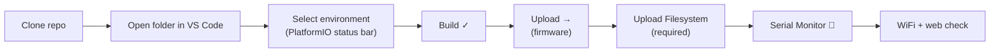

# KPPTR Firmware — Build & Flash Guide

> **Audience:** Developers building and flashing firmware onto PTR hardware.  
> **Primary toolchain:** **Visual Studio Code** + **PlatformIO IDE** extension  
> **Related docs:** [User Guide](USER_GUIDE.md) · [Developer Guide](DEVELOPER_GUIDE.md) · [Project Index](../INDEX.md)

---

## Table of Contents

1. [Overview](#1-overview)
2. [Prerequisites](#2-prerequisites)
3. [Clone and Open in VS Code](#3-clone-and-open-in-vs-code)
4. [Choose a Build Target](#4-choose-a-build-target)
5. [Build (VS Code / PlatformIO)](#5-build-vs-code--platformio)
6. [Upload Firmware to the Board](#6-upload-firmware-to-the-board)
7. [Flash the Web UI Partition](#7-flash-the-web-ui-partition)
8. [Serial Monitor](#8-serial-monitor)
9. [Verify the Installation](#9-verify-the-installation)
10. [CLI Reference (optional)](#10-cli-reference-optional)
11. [Alternative: ESP-IDF Command Line](#11-alternative-esp-idf-command-line)
12. [Dev Board (16 MB Flash) Setup](#12-dev-board-16-mb-flash-setup)
13. [Optional Build Flags](#13-optional-build-flags)
14. [Troubleshooting](#14-troubleshooting)

---

## 1. Overview

| Item | Value |
|------|-------|
| MCU | **ESP32-S3** |
| Framework | **ESP-IDF v5.5** (bundled by PlatformIO) |
| Build system | **PlatformIO** (`platformio.ini`) |
| **IDE (team standard)** | **VS Code** + [PlatformIO IDE](https://platformio.org/install/ide?install=vscode) extension |

The PTR team develops in **Visual Studio Code** using the PlatformIO sidebar for build, upload, filesystem flash, and serial monitor. The `pio` CLI is available from the VS Code integrated terminal for scripting — same backend, same results.

PlatformIO downloads the ESP32 toolchain and ESP-IDF on the **first build** (several GB, one-time download).



Every flash to the board requires **both** firmware upload **and** filesystem upload. Skipping filesystem upload leaves the web UI partition empty or stale.

### PlatformIO toolbar (bottom status bar)

Once the project is open, the blue PlatformIO bar at the bottom of VS Code shows:

| Icon | Action |
|------|--------|
| **✓ Checkmark** | Build |
| **→ Arrow** | Upload firmware |
| **🔌 Plug** | Serial monitor |
| **🗑 Bin** | Clean |
| **Environment name** (e.g. `PTR_mega_v1_0`) | Click to switch board target |

Advanced targets (e.g. **Upload Filesystem Image**) are under the **PlatformIO icon** in the left activity bar → **PROJECT TASKS** → `<environment>`.

---

## 2. Prerequisites

### Required software

| Tool | Purpose | Install |
|------|---------|---------|
| **Visual Studio Code** | IDE | [code.visualstudio.com](https://code.visualstudio.com/) |
| **PlatformIO IDE** extension | Build / flash / monitor inside VS Code | VS Code Extensions → search **PlatformIO IDE** → Install |
| **Git** | Clone and update source | [git-scm.com](https://git-scm.com/) |

> **Cursor / VS Code forks:** The PlatformIO extension works the same way — open the repo folder and use the PlatformIO sidebar.

### Recommended

- **USB data cable** (not charge-only) to the ESP32-S3 USB port
- **8 GB+ free disk** for PlatformIO packages and build output
- Windows: USB drivers if the port is not listed (many S3 boards use native USB-JTAG)

### First-time PlatformIO setup

1. Install VS Code.
2. Install the **PlatformIO IDE** extension (by PlatformIO).
3. Wait for PlatformIO Home to finish initial setup (progress in the bottom status bar).
4. Open this repository — PlatformIO detects `platformio.ini` automatically.

No separate ESP-IDF install is required; PlatformIO pulls **espressif32 @ 6.12.0** with **ESP-IDF v5.5** on first build.

---

## 3. Clone and Open in VS Code

### Clone

```bash
git clone https://github.com/PTR-projects/PTR_mega_firmware.git
```

Or SSH: `git clone git@github.com:PTR-projects/PTR_mega_firmware.git`

Your local folder may be named `kp-ptr-firmware` — that is fine.

### Open in VS Code

1. **File → Open Folder…**
2. Select the repository root (the folder containing `platformio.ini`).
3. If prompted, **Trust** the workspace.
4. Wait for PlatformIO to index the project (status bar shows activity).

### Switch branch (integrated terminal)

**Terminal → New Terminal** (`Ctrl+`` `):

```bash
git fetch origin
git checkout main
git pull
```

### Optional: multi-root workspace

The repo may include a `*.code-workspace` file for VS Code. **File → Open Workspace from File…** if you use it — otherwise opening the folder directly is enough.

---

## 4. Choose a Build Target

Pick the **PlatformIO environment** that matches your PCB. Defined in [`platformio.ini`](../platformio.ini):

| Environment | Hardware | Flash size | Partition file | WiFi SSID |
|-------------|----------|------------|----------------|-----------|
| **`PTR_mega_v0_1`** | PTR Mega prototype rev 0.1 | 8 MB | `partitions-8mb.csv` | `PTR-mega` |
| **`PTR_mega_v1_0`** | PTR Mega v1.0 | 32 MB | `partitions-32mb.csv` | `PTR-mega` |
| **`PTR_mini_v1_0`** | PTR Mini / ARecorder v3 | 32 MB | `partitions-32mb.csv` | `PTR-mini` |

### Select environment in VS Code

**Method A — status bar:** Click the environment name in the bottom PlatformIO bar → choose e.g. `PTR_mega_v1_0`.

**Method B — command palette:** `Ctrl+Shift+P` → **PlatformIO: Switch Project Environment**.

Wrong environment → wrong pin map and flash layout for your board.

### Flash partition layout (32 MB example)

| Partition | Offset | Size | Contents |
|-----------|--------|------|----------|
| `factory` | 0x10000 | 1.5 MB | Application firmware |
| `www` | 0x190000 | 512 KB | Web UI (SPIFFS) |
| `storage` | 0x210000 | ~30 MB | Flight logs |

8 MB boards: [`partitions-8mb.csv`](../partitions-8mb.csv).

---

## 5. Build (VS Code / PlatformIO)

### VS Code

1. Confirm the correct environment in the status bar.
2. Click the **✓ Build** icon (or **PlatformIO: Build** from the command palette).
3. Watch output in the **TERMINAL** panel (PlatformIO task).

First build can take **10–30+ minutes** while toolchains download.

### Success

Terminal ends with:

```
RAM:   xx%  ...
Flash: xx%  ...
========================= [SUCCESS] =========================
```

### What happens during build

1. PlatformIO runs `pio run -e <env>` with bundled ESP-IDF.
2. CMake configures project `ptr_mega`.
3. On a **clean build**, web assets in `components/Web_driver/www_uncompressed/` are minified into `components/Web_driver/www/` automatically (via `Web_driver/CMakeLists.txt` calling `helpers/minify_www.py`).
4. Output goes to `.pio/build/<ENV>/`.

> **Incremental builds** may skip CMake re-configuration, so changed `www_uncompressed` files are **not** always picked up. After editing web sources, run minify manually (see [§7](#7-flash-the-web-ui-partition-required)) or do a **Clean** + **Build**.

### Clean rebuild

Left sidebar → **PlatformIO** → **PROJECT TASKS** → `<your env>` → **General** → **Clean**, then **Build**.

Clean build re-runs CMake and **automatically minifies** `www_uncompressed` → `www`.

---

## 6. Upload Firmware to the Board

### Connect the board

1. Plug ESP32-S3 into USB; power LED on.
2. In VS Code: **PlatformIO: Upload** (→ arrow in status bar).

**If upload fails**, enter download mode manually:

- Hold **BOOT** → press **RESET** → release **RESET** → release **BOOT**

Most ESP32-S3 boards with USB-JTAG enter download mode automatically when upload starts.

### Set serial port (if needed)

**PlatformIO: Upload** usually auto-detects the port. To fix a wrong port:

1. **PlatformIO** sidebar → **PROJECT TASKS** → **PlatformIO** → **Devices** (lists COM ports).
2. Or add to `platformio.ini` under your `[env:...]`:

   ```ini
   upload_port = COM5
   monitor_port = COM5
   ```

| OS | Typical port |
|----|----------------|
| Windows | `COM3`, `COM5`, … |
| Linux | `/dev/ttyACM0` |
| macOS | `/dev/cu.usbmodem*` |

Upload writes **bootloader**, **partition table**, and **application** to flash.

> **This step alone is not enough.** You must also [upload the filesystem](#7-flash-the-web-ui-partition-required) — the web UI lives in a separate flash partition.

---

## 7. Flash the Web UI Partition (required)

Web pages live in a separate **`www`** SPIFFS partition. `platformio.ini` points PlatformIO at the minified output:

```ini
data_dir = components/Web_driver/www
```

**Upload Filesystem Image is mandatory** on every full flash to the board — not only on first install. Firmware upload and filesystem upload are two separate steps.

### Standard flash sequence (always)

| Step | VS Code action |
|------|----------------|
| 1 | **Build** ✓ |
| 2 | **Upload** → (firmware) |
| 3 | **Upload Filesystem Image** (required) |

**VS Code:** Left sidebar → **PlatformIO** → **PROJECT TASKS** → `<your env>` → **Platform** → **Upload Filesystem Image**

Run step 3 **after every Build + Upload**, including first-time setup and after firmware-only changes (filesystem must stay in sync with the flashed app).

### Editing web pages (`www_uncompressed`)

Source files live in `components/Web_driver/www_uncompressed/`. The board serves minified copies from `components/Web_driver/www/`.

**After any change to `www_uncompressed`:**

1. **Minify manually** (recommended — works without a full rebuild):

   ```bash
   python components/Web_driver/helpers/minify_www.py
   ```

   Run from the repo root, or from `components/Web_driver/` — the script resolves paths relative to itself.

2. **Build** ✓ (firmware, if C code also changed)
3. **Upload** →
4. **Upload Filesystem Image** (required)

**Alternative:** **Clean** + **Build** — CMake runs `minify_www.py` automatically during a clean build, so manual minify is optional if you always clean-build after web edits. For faster iteration, prefer the manual minify step above.

| Workflow | When to use |
|----------|-------------|
| Manual `minify_www.py` → Upload Filesystem | Web-only changes; fastest |
| Clean + Build → Upload → Upload Filesystem | Web + firmware changes; minify runs automatically |
| Build (incremental) → Upload → Upload Filesystem | Firmware-only changes; www folder unchanged |

---

## 8. Serial Monitor

### VS Code

Click the **🔌 Serial Monitor** icon in the PlatformIO status bar.

Default baud: **115200** (from project sdkconfig). Set in `platformio.ini` if needed:

```ini
monitor_speed = 115200
```

### Expected boot log (abbreviated)

```
I (xxxx) KP-PTR: Task Main - ready!
I (xxxx) KP-PTR: Task Storage - ready!
...
```

**Note:** Firmware waits **5 seconds** at boot before logging — normal, for debug attachment.

Close monitor: trash-can icon on the terminal tab, or **PlatformIO: Stop Monitor**.

---

## 9. Verify the Installation

| Step | Action | Expected |
|------|--------|----------|
| 1 | Power board, wait ~10 s | Status LEDs active |
| 2 | WiFi scan | **`PTR-mega`** or **`PTR-mini`** |
| 3 | Connect (password **`MeteorPTR`**) | WiFi linked |
| 4 | Browser → **`http://192.168.4.1/`** | Web UI loads |
| 5 | **Status** tab | Values update (not `????`) |
| 6 | Serial monitor | No boot loop |

See [User Guide — Connecting to the Web Interface](USER_GUIDE.md#5-connecting-to-the-web-interface).

---

## 10. CLI Reference (optional)

Same commands PlatformIO runs from VS Code — useful for CI or copy-paste in the integrated terminal (**Terminal → New Terminal**):

```bash
# Build
pio run -e PTR_mega_v1_0

# Upload firmware (required)
pio run -e PTR_mega_v1_0 -t upload

# Upload filesystem (required — always run with upload)
pio run -e PTR_mega_v1_0 -t uploadfs

# Minify web sources after editing www_uncompressed
python components/Web_driver/helpers/minify_www.py

# Serial monitor
pio device monitor -e PTR_mega_v1_0

# List ports
pio device list

# Clean
pio run -e PTR_mega_v1_0 -t clean
```

Upload + monitor in one step:

```bash
pio run -e PTR_mega_v1_0 -t upload -t monitor
```

---

## 11. Alternative: ESP-IDF Command Line

Only if you need native ESP-IDF outside PlatformIO. The team normally does **not** use this path.

### Setup

[ESP-IDF v5.5 install guide](https://docs.espressif.com/projects/esp-idf/en/v5.5/esp32s3/get-started/index.html), then:

```bash
. $HOME/esp/esp-idf/export.sh   # Linux / macOS
cp sdkconfig.PTR_mega_v1_0 sdkconfig
idf.py set-target esp32s3
idf.py build
idf.py -p COM5 flash monitor
```

Saved sdkconfig files: `sdkconfig.PTR_mega_v0_1`, `sdkconfig.PTR_mega_v1_0`, `sdkconfig.PTR_mini_v1_0`.

---

## 12. Dev Board (16 MB Flash) Setup

For **ESP32-S3-WROOM-1-N16R8** and similar, add to `platformio.ini`:

```ini
[env:PTR_dev_16mb]
board = esp32-s3-devkitc-1
board_upload.flash_size = 16MB
board_build.partitions = partitions-16mb.csv
build_flags = -DCONFIG_BOARD_PTR_MEGA_VER_1_REV_0
extends = env:PTR_mega_v1_0
```

Reload VS Code window (**Developer: Reload Window**), select **`PTR_dev_16mb`**, then **Build** → **Upload** → **Upload Filesystem Image** (all three required).

Bare dev kits do not match PTR PCB wiring without adapters.

---

## 13. Optional Build Flags

Add to `build_flags` in `platformio.ini` for the relevant `[env:...]`:

| Flag | Effect |
|------|--------|
| `-DCFG_CANSAT_ROCKET` | SBUS effector mapping for cansat rocket |
| `-DVERSION_TAG=\"1.2.3\"` | Version string (`${sysenv.VERSION_TAG}` in `platformio.ini`) |

Set `VERSION_TAG` in VS Code terminal before build:

```powershell
# Windows PowerShell
$env:VERSION_TAG="1.0.0"
```

```bash
# Linux / macOS
export VERSION_TAG=1.0.0
```

Then **Build** from the status bar.

---

## 14. Troubleshooting

| Problem | Solution |
|---------|----------|
| No PlatformIO icon / status bar | Install **PlatformIO IDE** extension; reload window |
| PlatformIO stuck on “Initializing” | Wait; check firewall; restart VS Code |
| **No devices** in upload | USB cable/port; BOOT+RESET; set `upload_port` in `platformio.ini` |
| **Upload timed out** | Add `upload_speed = 460800` under `[env]`; try download mode |
| **Flash size mismatch** | Wrong environment — 8 MB (`PTR_mega_v0_1`) vs 32 MB (v1 / mini) |
| **Boot loop** | Reflash with correct environment; check TERMINAL build errors |
| **Web page blank / broken** | Run **Upload Filesystem Image** — required on every flash, not optional |
| **Web changes not visible** | Run `python components/Web_driver/helpers/minify_www.py`, then **Upload Filesystem Image** |
| **IntelliSense errors** (red squiggles) | Normal for ESP-IDF until first successful build; run **PlatformIO: Rebuild IntelliSense Index** |
| **Python / minify error** | Allow PlatformIO Python to install packages; or run `minify_www.py` manually |
| Linux **permission denied** on port | `sudo usermod -aG dialout $USER`, re-login |

### Erase entire flash (last resort)

VS Code terminal:

```bash
pio pkg exec -p "tool-esptoolpy" -- esptool.py --chip esp32s3 -p COM5 erase_flash
```

Then **Upload** + **Upload Filesystem Image** again. **Deletes flight logs and settings.**

---

## Quick Reference (VS Code workflow)

```
1. Open repo folder in VS Code
2. Status bar → select PTR_mega_v1_0 (or your board)
3. ✓ Build
4. → Upload                    (firmware — required)
5. Upload Filesystem Image     (required — always, not optional)
6. 🔌 Serial Monitor
7. WiFi PTR-mega → http://192.168.4.1/

After www_uncompressed edits:
   python components/Web_driver/helpers/minify_www.py
   → repeat steps 5 (Upload Filesystem Image)
   (or Clean + Build to minify automatically, then steps 3–5)
```

---

*Document version: 2026-08-31 · Primary IDE: VS Code + PlatformIO · Firmware: main @ 27304e2*
