# KPPTR Firmware — Developer Guide

> **Audience:** Engineers onboarding to the KP-PTR flight computer firmware.  
> **Scope:** Execution flow, algorithms, state machines, task architecture, and data paths.  
> **Target:** ESP32-S3 · ESP-IDF v5.5 · FreeRTOS · PlatformIO

---

## Documentation Plan

This guide was structured to mirror how the firmware actually runs — bottom-up from hardware init, through the 100 Hz main loop, to recovery events. Recommended reading order for new developers:

| Phase | Sections | Goal |
|-------|----------|------|
| 1 — Orientation | §1–§3 | Understand what the firmware does and how tasks are laid out |
| 2 — Runtime | §4–§7 | Trace boot → main loop → queues → outputs |
| 3 — Flight logic | §8–§10 | Learn arming safety and the flight state machine |
| 4 — Algorithms | §11–§12 | AHRS, Kalman filters, sensor fusion |
| 5 — I/O & comms | §13–§16 | Effectors, logging, LoRa, web UI |
| 6 — Reference | §17–§20 | Config, components, boards, build |

**Maintenance:** When changing `DataPackage_t`, flight states, or task rates, update the matching section and its diagram. `INDEX.md` remains the quick project index; this document is the deep dive.

### Changelog (vs. initial guide)

| Area | Change |
|------|--------|
| FSD PREFLIGHT | Launch detected by **≥ 2.6 g** on `acc_axis_lowpass`, not a fixed timer |
| LoRa TX payload | `kppacket_payload_rocket_t` replaces deprecated `legacyfull`; pressure is **float Pa** |
| Web UI | **CSV download** of flight log; `ign_set` fires a **100 ms** pulse then auto-off |
| Auto-arming | Disarm works after auto-arm (`ready_to_arm_time_passed` set on any arm event) |
| FreeRTOS | Board sdkconfigs use **`CONFIG_FREERTOS_HZ=1000`** (1 ms tick) for accurate 10 ms main loop |
| LED / analog | IGN continuity LEDs update every **4 s** (was ~0.5 s); `LED_driver` uses mutex (SysMgr race fix) |
| Flash log | `ign*_state` fields logged in `DataPackage_t`; web CSV parser expects **112-byte** records |

---

## Table of Contents

1. [System Overview](#1-system-overview)
2. [Boot and Initialization](#2-boot-and-initialization)
3. [FreeRTOS Task Architecture](#3-freertos-task-architecture)
4. [Inter-Task Communication](#4-inter-task-communication)
5. [Main Loop Execution Flow](#5-main-loop-execution-flow)
6. [Flight State Machine (FSD)](#6-flight-state-machine-fsd)
7. [Arming and System Manager](#7-arming-and-system-manager)
8. [AHRS Algorithms](#8-ahrs-algorithms)
9. [Sensor Pipeline](#9-sensor-pipeline)
10. [Effector System](#10-effector-system)
11. [Data Manager and Flash Logging](#11-data-manager-and-flash-logging)
12. [Telemetry (TMTC / LoRa)](#12-telemetry-tmtc--lora)
13. [Web Interface and Commands](#13-web-interface-and-commands)
14. [Configuration and Preferences](#14-configuration-and-preferences)
15. [Component Reference](#15-component-reference)
16. [Board Variants](#16-board-variants)
17. [Build and Debug](#17-build-and-debug)

---

## 1. System Overview

KPPTR (KP-PTR) is an on-board flight computer for amateur rockets and high-altitude balloons. It:

- Samples IMU, barometer, magnetometer, and high-G accelerometer at **100 Hz**
- Estimates attitude (Mahony AHRS) and altitude/ascent rate (dual Kalman filters)
- Detects flight phases and triggers pyrotechnic igniters or servo/SBUS outputs
- Logs high-rate data to flash during flight
- Streams telemetry over **LoRa 433 MHz** and a **WiFi web UI**

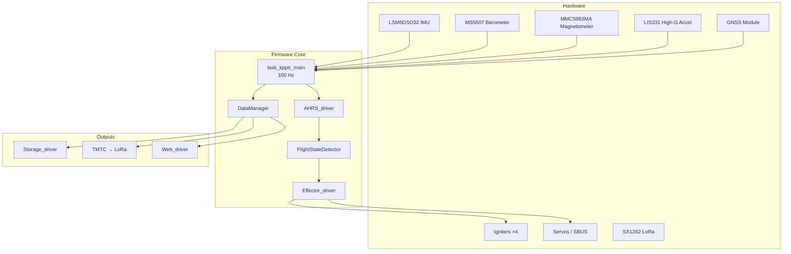

### Key source files

| Area | Entry point |
|------|-------------|
| Application boot | `main/main.c` → `app_main()` |
| Flight logic | `components/FlightStateDetector/FlightStateDetector.c` |
| Attitude / altitude | `components/AHRS_driver/AHRS_driver.c` |
| Effector abstraction | `components/Effector_driver/Effector_driver.c` |
| Data packaging | `components/DataManager/DataManager.c` |

---

## 2. Boot and Initialization

`app_main()` runs on Core 0, performs synchronous setup, then spawns all worker tasks.

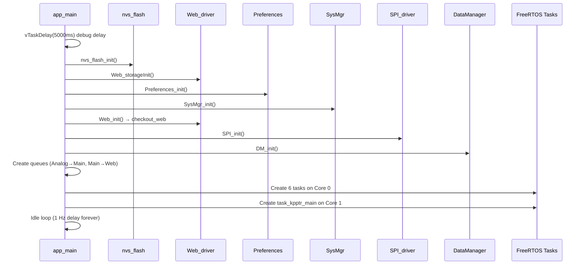

### Initialization order

| Step | Function | Notes |
|------|----------|-------|
| 1 | `nvs_flash_init()` | NVS for WiFi stack |
| 2 | `Web_storageInit()` | SPIFFS www partition |
| 3 | `Preferences_init()` | Mission config from SimpleFS/NVS |
| 4 | `SysMgr_init()` | Health checkout queues |
| 5 | `Web_init()` | WiFi AP + HTTP server |
| 6 | `SPI_init()` | Shared SPI bus for sensors + LoRa |
| 7 | `DM_init()` | 100-slot ring buffer for flash logging |
| 8 | Task creation | See §3 |

Each task performs its own **retry-until-ready** init loop and reports status via `SysMgr_checkout(component, state)`.

---

## 3. FreeRTOS Task Architecture

Tasks are pinned to cores to isolate the timing-critical sensor loop from I/O-heavy work.

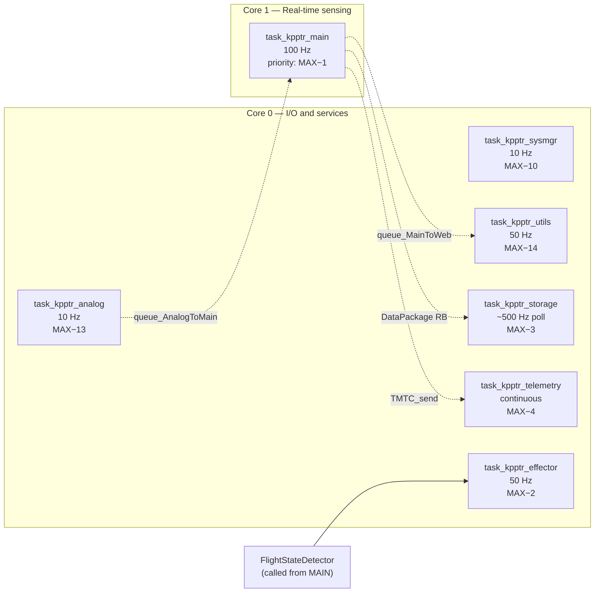

### Task summary

| Task | Core | Period | Priority | Responsibility |
|------|------|--------|----------|----------------|
| `task_kpptr_main` | 1 | 10 ms (100 Hz) | `configMAX_PRIORITIES − 1` | Sensors, AHRS, FSD, data collect, RF/web feed |
| `task_kpptr_effector` | 0 | 20 ms (50 Hz) | `− 2` | Igniters, PWM servos, SBUS, timed deactivation |
| `task_kpptr_telemetry` | 0 | continuous | `− 4` | LoRa RX/TX via `TMTC_process()` |
| `task_kpptr_storage` | 0 | 2 ticks (~500 Hz poll) | `− 3` | Flash write during flight |
| `task_kpptr_analog` | 0 | 100 ms (10 Hz) | `− 13` | Vbat, igniter continuity ADC |
| `task_kpptr_utils` | 0 | 20 ms (50 Hz) | `− 14` | WS2812 LEDs, buzzer, web live push |
| `task_kpptr_sysmgr` | 0 | 100 ms (10 Hz) | `− 10` | Health LEDs, auto-arm, FSD beeps |

Timing constants are in `components/CONFIG/include/CONFIG.h`:

```c
#define CONFIG_MAIN_LOOP_FREQUENCY        100  // Hz
#define CONFIG_TELEMETRY_FREQUENCY          1  // Hz (ground)
#define CONFIG_TELEMETRY_FREQUENCY_FLIGHT   2  // Hz (in flight)
```

### FreeRTOS tick rate

Board sdkconfigs (`sdkconfig.PTR_mega_v*`, `sdkconfig.PTR_mini_v*`) set **`CONFIG_FREERTOS_HZ=1000`**, giving a 1 ms scheduler tick. This improves accuracy of `vTaskDelayUntil()` for the 10 ms main loop and the 2-tick storage poll (~2 ms at 1 kHz tick ≈ 500 Hz poll rate). Use the board-specific sdkconfig when building via PlatformIO — the root `sdkconfig` may still show 100 Hz and should not be used as reference for production builds.

---

## 4. Inter-Task Communication

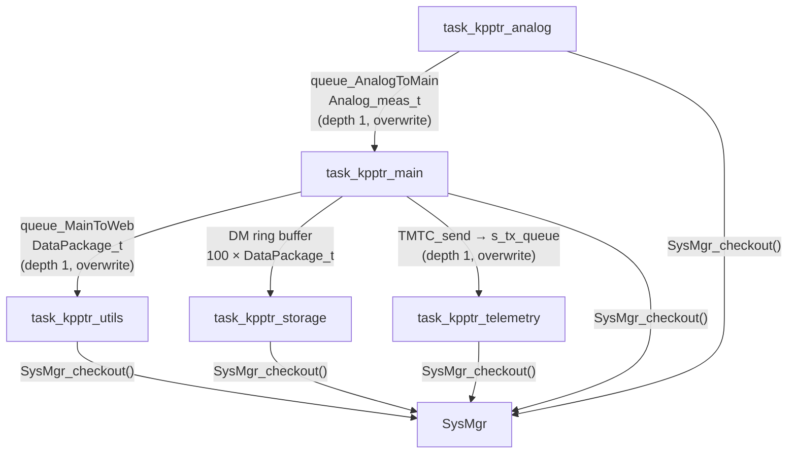

### Ring buffer (Main ↔ Storage)

`DataManager` maintains a **100-element pointer ring**:

- `queue_StorageFree` — slots available for the main task to fill
- `queue_StorageUsed` — slots waiting for storage task to write

If the main loop outruns storage and all slots are full, `DM_getFreePointerToMainRB()` **drops the oldest** sample by reclaiming from the used queue — a deliberate trade-off to keep the 100 Hz loop non-blocking.

---

## 5. Main Loop Execution Flow

Each iteration of `task_kpptr_main` (10 ms tick via `vTaskDelayUntil`):

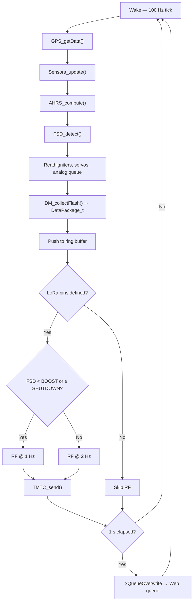

### Pseudocode

```c
while (1) {
    vTaskDelayUntil(&tick, 10 ms);

    GPS_getData(&gps);
    Sensors_update();
    AHRS_compute(time_us, Sensors_get(), gps);
    FSD_detect(time_us / 1000);

    xQueueReceive(queue_AnalogToMain, &analog, 0);
    DM_collectFlash(&pkg, ...);

    // Ring buffer — non-blocking
    DM_getFreePointerToMainRB(&ptr);
    *ptr = pkg;
    DM_addToMainRB(&ptr);

    // LoRa — 1 Hz ground, 2 Hz in flight
    if (should_send_rf) {
        DM_collectRF(&rf_pkt, ...);
        TMTC_send(&rf_pkt);
    }

    // Web — 1 Hz
    if (1 s elapsed)
        xQueueOverwrite(queue_MainToWeb, ptr);
}
```

---

## 6. Flight State Machine (FSD)

The **Flight State Detector** (`FlightStateDetector.c`) is the mission brain. It runs inside the main task at 100 Hz and drives effector activation.

### States

| Enum | Name | Purpose |
|------|------|---------|
| `FLIGHTSTATE_STARTUP` | Startup | Gyro cal, ref pressure, wait 500 ms |
| `FLIGHTSTATE_PREFLIGHT` | Preflight | Ground calibration; waits for **launch detection** (≥ 2.6 g) |
| `FLIGHTSTATE_BOOST` | Boost | Motor burn; sets AHRS in-flight mode |
| `FLIGHTSTATE_SECOND_STAGE_DELAY` | Stage-2 delay | Countdown before stage-2 igniter |
| `FLIGHTSTATE_SECOND_STAGE_IGNITION` | Stage-2 ignition | Fire `EFFECTOR_STAGE2_IGN` |
| `FLIGHTSTATE_SECOND_STAGE_BOOST` | Stage-2 boost | Second motor burn detection |
| `FLIGHTSTATE_FREEFLIGHT` | Free flight | Coast to apogee |
| `FLIGHTSTATE_FREEFALL` | Freefall | Apogee detected → deploy drogue |
| `FLIGHTSTATE_DRAGCHUTE_FALL` | Drogue descent | Monitor descent rate / main alt |
| `FLIGHTSTATE_DRAGCHUTE_FAILURE` | Drogue failure | Backup: fire drogue + main |
| `FLIGHTSTATE_MAINSHUTE_FALL` | Main chute descent | Under main canopy |
| `FLIGHTSTATE_RECOVERY_FAILURE` | Recovery failure | Both chutes suspect |
| `FLIGHTSTATE_LANDING` | Landing | On ground, low velocity |
| `FLIGHTSTATE_SHUTDOWN` | Shutdown | Mission complete (30 s after landing) |

### State diagram

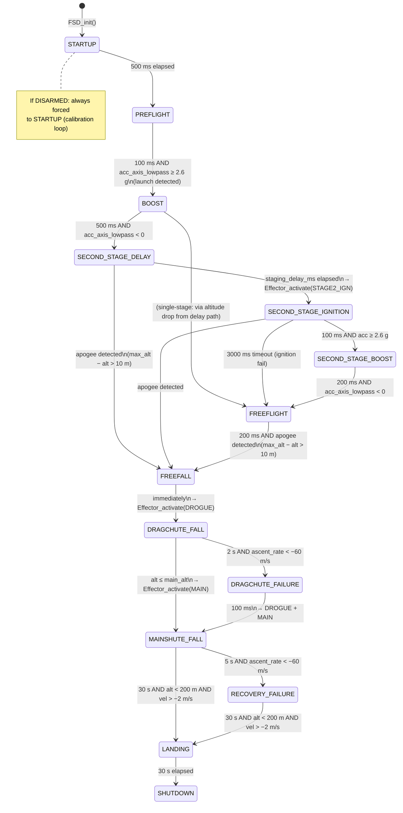

### Apogee detection algorithm

Apogee (transition to `FREEFALL`) uses barometric altitude from AHRS:

```
max_altitude ≥ altitudeP  AND  (max_altitude − altitudeP) > 10 m
```

- `max_altitude` — running peak tracked in AHRS (reset on ground when disarmed)
- `ALTITUDE_DROP_TRIGGER` = **10 m** drop from peak
- Minimum state dwell: **200 ms** (debounce via `TIME_ELAPSED`)

### Launch detection (PREFLIGHT → BOOST)

While armed in `PREFLIGHT`, the firmware waits for motor ignition — not a fixed timeout:

```
acc_axis_lowpass = 0.05 × acc_x + 0.95 × acc_axis_lowpass   // EMA on body X accel [m/s²]
TIME_ELAPSED(100 ms)  AND  acc_axis_lowpass ≥ 2.6 × 9.81   →  FLIGHTSTATE_BOOST
```

The **2.6 g threshold** is shared with stage-2 burn confirmation. Until launch is detected, the rocket remains in `PREFLIGHT` with continuous gyro calibration (gain 0.001) and reference-pressure updates.

### Motor burnout detection

Boost end is inferred when the low-pass filtered body-axis acceleration goes negative:

```
acc_axis_lowpass < 0  →  motor burnout
```

Stage-2 ignition confirmation uses the same **≥ 2.6 g** threshold after igniter fire.

### Disarmed behaviour

When `FSD_checkArmed() == DISARMED`, `FSD_detect()` **forces** `FLIGHTSTATE_STARTUP` every cycle and continuously:

- Updates reference pressure (`Sensors_UpdateReferencePressure`)
- Resets max altitude (`AHRS_resetMaxAltitude`)
- Calibrates gyro (`Sensors_calibrateGyro`)

This keeps ground calibration active until the operator arms.

---

## 7. Arming and System Manager

Two related but distinct concepts:

| Concept | Owner | Meaning |
|---------|-------|---------|
| **FSD arming** | `FlightStateDetector` | Enables flight state progression; arms effectors |
| **SysMgr arming display** | `SysMgr` + `task_kpptr_sysmgr` | UI/LED reflection of armed state |

### FSD arming flow

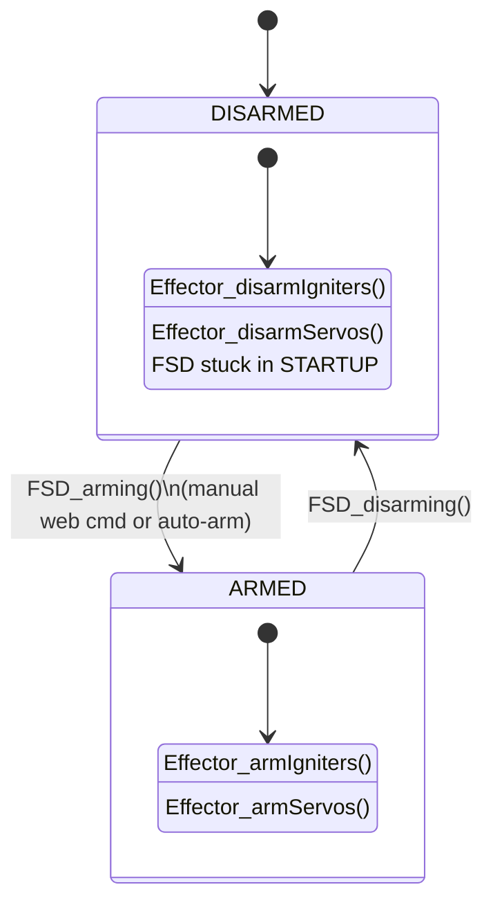

### Auto-arming (`task_kpptr_sysmgr`)

1. All components report `check_ready` via `SysMgr_getCheckoutStatus()`
2. After configurable delay (default **30 s**, range 30–300 s from `Preferences.auto_arming_time_s`)
3. If `Preferences.auto_arming == true` → calls `FSD_arming()`
4. Buzzer confirms arm and each FSD state change

When the system becomes armed (auto or manual via web), `ready_to_arm_time_passed` is set so the auto-arm countdown does not re-fire. **Disarm via web always works** after auto-arm — a previous bug kept the countdown logic active and blocked disarm.

### IGN continuity LEDs (`task_kpptr_analog`)

Igniter continuity WS2812 indicators refresh every **40 analog cycles** (10 Hz task → ~4 s interval) to reduce power consumption. Values come from `Analog_meas_t.IGN_det[]`.

### Component health checkout

Each subsystem calls `SysMgr_checkout(component, state)`:

| State | Value | LED (STAT) |
|-------|-------|------------|
| `check_ready` | 0x01 | Green blink |
| `check_void` | 0x02 | Orange blink |
| `check_fail` | 0x04 | Red blink |

Aggregate status: **any fail → fail; else any void → void; else ready**.

Monitored components: `sysmgr`, `main`, `storage`, `lora`, `analog`, `utils`, `web`, `gnss`, `effector`.

---

## 8. AHRS Algorithms

The AHRS module fuses sensor data into orientation, pressure altitude, and (in flight) Kalman-filtered altitude/ascent rate.

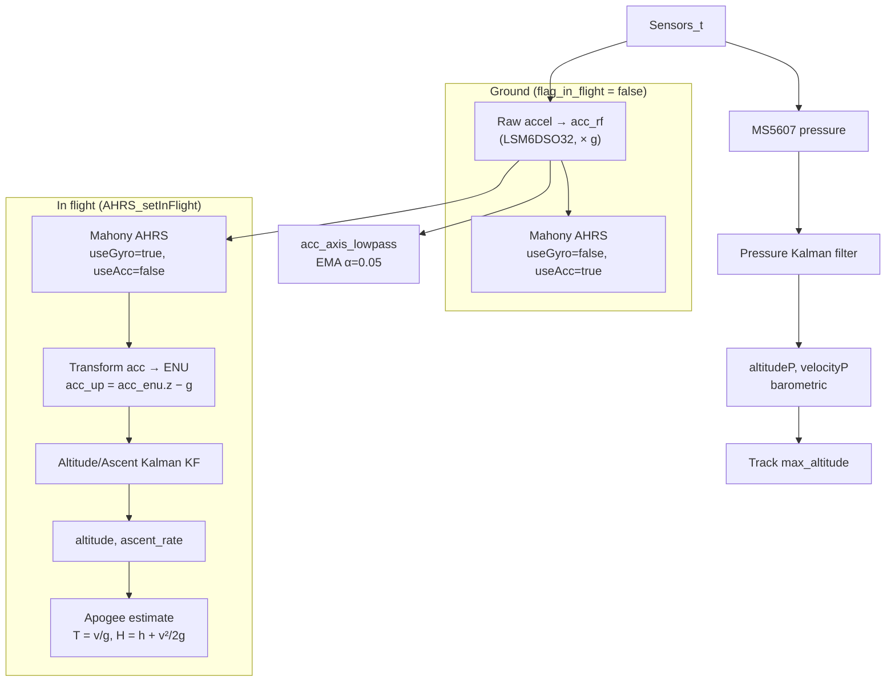

### 8.1 Mahony complementary filter

Based on Betaflight/iNav IMU code. Maintains a **unit quaternion** and rotation matrix.

| Parameter | Value | Notes |
|-----------|-------|-------|
| `dcmKpGain` | 2.5 | Proportional gain |
| `dcmKiGain` | 30/10000 | Integral gain |
| Acc correction | When ‖a‖ ≈ 1 g | Cross product with gravity estimate |
| Mag correction | Optional (`orientation_useMag`) | Heading only, disabled by default |
| Gyro integration | Disabled on ground | Enabled after `AHRS_setInFlight()` |

Outputs: rotation matrix `rMat[3][3]`, Euler angles (roll, pitch, yaw), tilt = `√(pitch² + yaw²)`.

### 8.2 Barometric altitude (pressure Kalman)

Inline 1D Kalman on **pressure** (not altitude directly):

| Parameter | Value |
|-----------|-------|
| Process noise `w` | 0.4 |
| Measurement noise `R` | 207.0 |
| Valid pressure range | 1000–120000 Pa |

Altitude conversion (standard atmosphere):

```
altitudeP = (1 − (P/P_ref)^0.190295) × 44330
velocityP = EMA(ΔaltitudeP / dt, α=0.05)
```

Reference pressure `P_ref` comes from `Sensors.ref_press`, exponentially averaged on the ground.

### 8.3 Altitude / ascent Kalman filter

Separate 2-state Kalman (`KF_AltitudeAscent.c`), active only in flight.

**State vector:** `x = [h, v]ᵀ` (altitude, vertical velocity)

**Model:**

```
h_k = h_{k-1} + v_{k-1}·dt + ½·acc_up·dt²
v_k = v_{k-1} + acc_up·dt
```

**Measurement:** `z = altitudeP` (barometric)

| Parameter | Default |
|-----------|---------|
| `Q_accel` | 0.1 |
| `R_altitude` | 0.1 |

Reference implementation: [AltitudeKF](https://github.com/rblilja/AltitudeKF).

### 8.4 Apogee estimation

Simple ballistic coast model (when `ascent_rate > 0`):

```
time_to_apogee_est  = ascent_rate / g
apogee_altitude_est = altitude + ascent_rate² / (2g)
```

---

## 9. Sensor Pipeline

`Sensors.c` aggregates low-level drivers into a single `Sensors_t` struct.

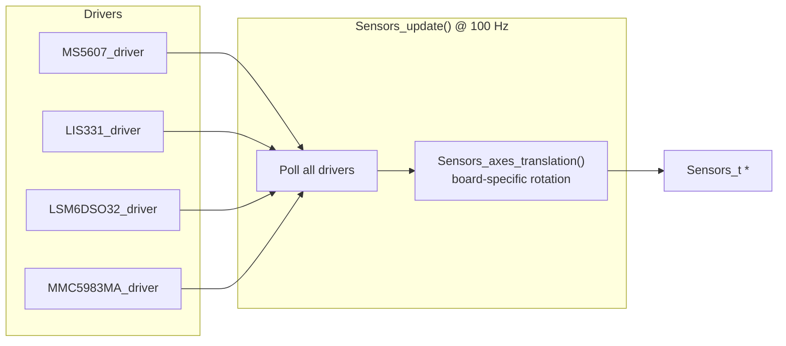

### Sensors_t contents

| Field | Source | Use |
|-------|--------|-----|
| `LSM6DSO32` | IMU SPI | AHRS primary accel/gyro |
| `LIS331` | High-G SPI | Up to ~400 g shock logging |
| `MMC5983MA` | Mag SPI | Optional heading (AHRS) |
| `MS5607` | Baro SPI | Pressure altitude |
| `ref_press` | EMA of MS5607 | Ground reference |

### Axis translation

Each board variant (`CONFIG_BOARD_*`) applies a fixed rotation matrix in `Sensors_axes_translation()` so body frame aligns with rocket coordinates regardless of PCB mounting.

### Ground calibration

| Function | When | Action |
|----------|------|--------|
| `Sensors_UpdateReferencePressure()` | STARTUP/PREFLIGHT/DISARMED | `ref_press = 0.005×P + 0.995×ref_press` |
| `Sensors_calibrateGyro(gain)` | STARTUP (0.1) / PREFLIGHT (0.001) | Zero-rate gyro correction |

---

## 10. Effector System

`Effector_driver` provides a unified registry for igniters, PWM servos, and SBUS channels.

### Registered effectors (default rocket config)

| ID | Name | Type | HW | Activation time |
|----|------|------|-----|-----------------|
| `EFFECTOR_DROGUE` | Drogue chute | Igniter | Channel 0 | 100 ms |
| `EFFECTOR_MAIN` | Main chute | Igniter | Channel 1 | 100 ms |
| `EFFECTOR_STAGE2_IGN` | Stage-2 motor | Igniter | Channel 2 | 100 ms |

With `CFG_CANSAT_ROCKET`, drogue/main/cansats map to **SBUS servo channels** instead.

### Effector state machine (per effector)

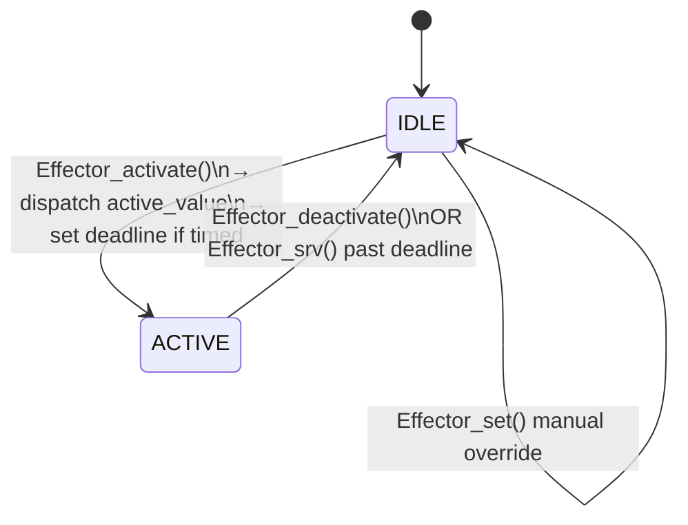

### Safety interlocks

1. **FSD arming** must call `Effector_armIgniters()` / `Effector_armServos()`
2. `Effector_activate()` checks arm flags unless `ignore_arm == true`
3. `IGN_driver` only fires if counter allows (one-shot semantics per channel)
4. Timed activations auto-deactivate via `Effector_srv()` at 50 Hz

### FSD → Effector triggers

| Flight state | Effector activated |
|--------------|-------------------|
| `SECOND_STAGE_DELAY` → `SECOND_STAGE_IGNITION` | `EFFECTOR_STAGE2_IGN` |
| `FREEFALL` | `EFFECTOR_DROGUE` |
| `DRAGCHUTE_FALL` (alt ≤ main_alt) | `EFFECTOR_MAIN` |
| `DRAGCHUTE_FAILURE` | `EFFECTOR_DROGUE` + `EFFECTOR_MAIN` |

---

## 11. Data Manager and Flash Logging

### DataPackage_t

Packed binary snapshot (**112 bytes**, `DATAPACKAGE_SIZE` in web scripts) written to flash inside SimpleFS packets and streamed to web. Key fields:

| Section | Fields |
|---------|--------|
| `sys_time` | Timestamp (0.1 ms units) |
| `sensors` | All IMU, mag, high-G, pressure, GNSS |
| `ahrs` | Pressure/Kalman altitude, quaternions, tilt |
| `flightstate` | `flightstate_t` enum |
| `ign` | Continuity + **GPIO fire state** per channel (added in flash structure update) |
| `vbat_mV` | Battery |
| `servo` | Positions + enable |

> **Warning:** Any change to `DataPackage_t` requires updating the web CSV parser in `components/Web_driver/www/scripts.js` (and the uncompressed source).

### Storage task behaviour

```
Active only when: FLIGHTSTATE_BOOST ≤ state < FLIGHTSTATE_SHUTDOWN
Poll interval:    2 FreeRTOS ticks (minimum)
Write target:     /storage/meas.bin (SPIFFS or LittleFS)
Error handling:   >1000 consecutive failures → halt writes, report check_fail
```

---

## 12. Telemetry (TMTC / LoRa)

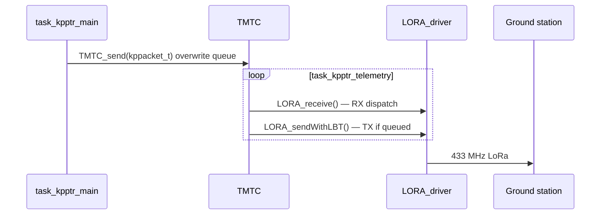

### TX rate

| Phase | Rate | Condition |
|-------|------|-----------|
| Ground | 1 Hz | `state < BOOST` or `state ≥ SHUTDOWN` |
| In flight | 2 Hz | `BOOST ≤ state < SHUTDOWN` |

### Packet format

Main loop sends `PACKET_LEGACY_FULL` (`0xAA`) with payload type **`kppacket_payload_rocket_t`** (via `DM_collectRF()`):

| Field | Type / scale |
|-------|----------------|
| `state`, `flags` | `uint8_t` |
| `vbat_10` | Vbat × 10 |
| `accX/Y/Z_100` | Acceleration × 100 [g] |
| `gyroX/Y/Z_10` | Gyro × 10 [deg/s] |
| `tilt_100` | Tilt × 100 [deg] |
| `pressure` | **float [Pa]** (was fixed-point in older `legacyfull` format) |
| `velocity_10` | Ascent rate × 10 [m/s] |
| `altitude` | Kalman altitude [m] |
| `lat`, `lon` | × 1e7 [deg] |
| `alti_gps` | GNSS altitude [mm] |
| `sats_fix` | 6-bit sat count + 2-bit fix |

Header is built with `DataPacket_build_msg()` using the standard `kppacket_header_t` (includes `dest_id`). Ground-station parsers must be updated for the new payload layout.

RX dispatch handles:

- `PACKET_HEARTBEAT` — log sender ID
- `PACKET_CUSTOM_16B` — Cansat packets via `Cansat_parsePacket()`

LoRa is compiled out on boards without `RF_BUSY_PIN`, `RF_RST_PIN`, `SPI_SLAVE_SX1262_PIN` (e.g. PTR mini).

---

## 13. Web Interface and Commands

- **URL:** `http://192.168.4.1/` (WiFi AP: `PTR-mega` or `PTR-mini`, password `MeteorPTR`)
- **Assets:** SPIFFS `www` partition (`components/Web_driver/www/`)
- **Live data:** 1 Hz push from `task_kpptr_utils` via `Web_live_from_DataPackage()`
- **Status:** 10 Hz from `task_kpptr_sysmgr` via `Web_status_updateSysMgr()`

### Flight log download

| Action | Handler | Output |
|--------|---------|--------|
| Raw binary | `storage_download_handler()` | `/storage/meas.bin` direct download |
| CSV export | `storage_download_csv_handler()` | Client-side parse of SimpleFS packets (128 B each, CRC16) → `meas.csv` |

The CSV converter runs in the browser (`www/scripts.js`): it validates preamble `0xAA55`, checks CRC, extracts the 112-byte `DataPackage_t` payload, and emits columns matching `CSV_HEADER` (includes all igniter continuity/state fields).

### JSON commands (`Web_driver_cmd.c`)

All commands require matching `"key"` (master key from preferences / `CONFIG_KPPTR_MASTERKEY`).

| Command | Action |
|---------|--------|
| `"arm"` | `FSD_arming()` if currently disarmed |
| `"disarm"` | `FSD_disarming()` |
| `"ign_set"` + `arg1` 1–4 | Manual igniter test: **100 ms ON** then auto-OFF via `IGN_handle()` (blocked if already ON) |
| `"config_default"` | `Preferences_restore_dafaults()` |

---

## 14. Configuration and Preferences

`Preferences_data_t` (persisted via SimpleFS/NVS):

| Field | Used by | Description |
|-------|---------|-------------|
| `drouge_alt_m` | FSD settings | Drogue deploy altitude (legacy; FSD uses main_alt for main) |
| `main_alt_m` | FSD | Main chute deployment altitude AGL |
| `rail_height_mm` | FSD | Launch rail height |
| `max_tilt_deg` | FSD | Max tilt threshold |
| `staging_delay_ms` | FSD | Delay before stage-2 ignition |
| `staging_max_tilt` | FSD | Max tilt during staging |
| `auto_arming` | SysMgr task | Enable countdown auto-arm |
| `auto_arming_time_s` | SysMgr task | 30–300 s countdown |
| `lora_freq_khz`, `lora_key` | LoRa driver | RF parameters |
| `wifi_pass` | Web_driver | AP password override |

FSD loads these in `FSD_init()`; failure to read preferences causes init to fail.

---

## 15. Component Reference

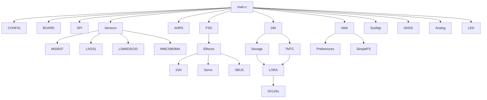

| Component | Directory | Role |
|-----------|-----------|------|
| **CONFIG** | `components/CONFIG/` | Global timing constants |
| **BOARD_cfg** | `components/BOARD_cfg/` | Pin maps, board macros |
| **Sensors** | `components/Sensors/` | Sensor aggregation + axis remap |
| **AHRS_driver** | `components/AHRS_driver/` | Mahony + Kalman filters |
| **FlightStateDetector** | `components/FlightStateDetector/` | Mission state machine |
| **Effector_driver** | `components/Effector_driver/` | Unified actuator API |
| **IGN_driver** | `components/IGN_driver/` | Pyrotechnic GPIO outputs |
| **Servo_driver** | `components/Servo_driver/` | MCPWM servo outputs |
| **SBUS_driver** | `components/SBUS_driver/` | Futaba S.Bus UART |
| **DataManager** | `components/DataManager/` | Ring buffer + packet assembly |
| **Storage_driver** | `components/Storage_driver/` | High-rate flash logging |
| **PTR_DataPacket** | `components/PTR_DataPacket/` | Binary protocol + encryption |
| **TMTC** | `components/TMTC/` | Telemetry/telecommand layer |
| **LORA_driver** | `components/LORA_driver/` | SX1262 wrapper |
| **Web_driver** | `components/Web_driver/` | WiFi AP, HTTP, JSON API |
| **Preferences** | `components/Preferences/` | Persistent mission config |
| **SysMgr** | `components/SysMgr/` | Health monitoring + arming UI |
| **Analog_driver** | `components/Analog_driver/` | ADC: Vbat, igniter continuity |
| **GNSS_driver** | `components/GNSS_driver/` | UART NMEA parser |
| **LED_driver** | `components/LED_driver/` | WS2812 + buzzer (mutex-protected; init before SysMgr LED updates) |
| **Cansat_driver** | `components/Cansat_driver/` | Optional cansat deployment |
| **SimpleFS_driver** | `components/SimpleFS_driver/` | Lightweight config filesystem |
| **SPI_driver** | `components/SPI_driver/` | Shared SPI bus manager |

---

## 16. Board Variants

Selected at compile time via `platformio.ini` environment → `CONFIG_BOARD_*` macro.

| Environment | Macro | Flash | Notable differences |
|-------------|-------|-------|---------------------|
| `PTR_mega_v0_1` | `CONFIG_BOARD_PTR_MEGA_VER_0_REV_1` | 8 MB | Prototype; single IMU |
| `PTR_mega_v1_0` | `CONFIG_BOARD_PTR_MEGA_VER_1_REV_0` | 32 MB | Dual LSM6DSO32, 8× WS2812, LoRa |
| `PTR_mini_v1_0` | `CONFIG_BOARD_ARECORDER_VER_3_REV_0` | 32 MB | 3 igniters, no LoRa pins |

Pin definitions: `components/BOARD_cfg/include/BOARD_cfg.h`

Optional build flag: **`CFG_CANSAT_ROCKET`** — remaps effectors to SBUS channels.

---

## 17. Build and Debug

### Build (PlatformIO)

```bash
pio run -e PTR_mega_v1_0
pio run -e PTR_mega_v1_0 -t upload
pio device monitor
```

### Partition layout (32 MB example)

| Partition | Size | Purpose |
|-----------|------|---------|
| `nvs` | 24 KB | NVS key-value |
| `factory` | 1.5 MB | Application firmware |
| `www` | 512 KB | Web UI (SPIFFS) |
| `storage` | ~30 MB | Flight logs |

See `partitions-{8,16,32}mb.csv`.

### Debug tips

| Symptom | Check |
|---------|-------|
| Stuck in STARTUP | System disarmed — arm via web or wait for auto-arm |
| Stuck in PREFLIGHT (armed) | Waiting for launch — need **≥ 2.6 g** on `acc_axis_lowpass` for 100 ms |
| Red STAT LED | `SysMgr_getComponentState()` — which checkout failed |
| Boot loop / LED errors | Ensure `LED_init()` completes before SysMgr drives WS2812 (mutex fix in `LED_driver`) |
| No flash logging | FSD state must be ≥ BOOST; storage checkout |
| No LoRa TX | Board has LoRa pins defined; LORA_init checkout |
| AHRS drift on pad | Reference pressure updating; gyro cal running |
| Cannot disarm after auto-arm | Should be fixed — verify `ready_to_arm_time_passed` logic in `task_kpptr_sysmgr` |

### Serial monitor

`app_main()` includes a **5 s boot delay** for serial attachment. Tag filter: `KP-PTR`, `FSD`, `Effector`, `Data ag.`, `SysMgr`.

---

## Appendix A — Complete Mission Timeline

```mermaid
gantt
    title Typical single-stage rocket mission
    dateFormat X
    axisFormat %S s

    section Ground
    Boot + init           :0, 8
    Checkout + auto-arm   :8, 38
    STARTUP cal           :38, 39
    PREFLIGHT wait launch :39, 44

    section Ascent
    BOOST motor burn      :44, 50
    FREEFLIGHT coast      :50, 90

    section Recovery
    FREEFALL apogee       :90, 90
    DRAGCHUTE_FALL        :90, 120
    MAINSHUTE_FALL        :120, 180
    LANDING               :180, 210
    SHUTDOWN              :210, 240
```

---

## Appendix B — Glossary

| Term | Meaning |
|------|---------|
| AHRS | Attitude and Heading Reference System |
| FSD | Flight State Detector |
| TMTC | Telemetry & TeleCommand layer |
| ENU | East-North-Up local frame |
| AGL | Altitude above ground level (baro-derived) |
| LBT | Listen-Before-Talk (LoRa CSMA) |

---

*Document version: 2026-08-31 (updated for main @ 27304e2) · Source: `kp-ptr-firmware`*
