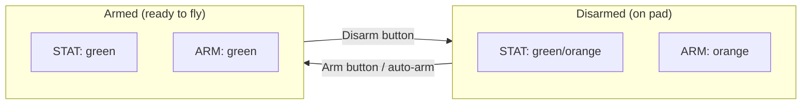
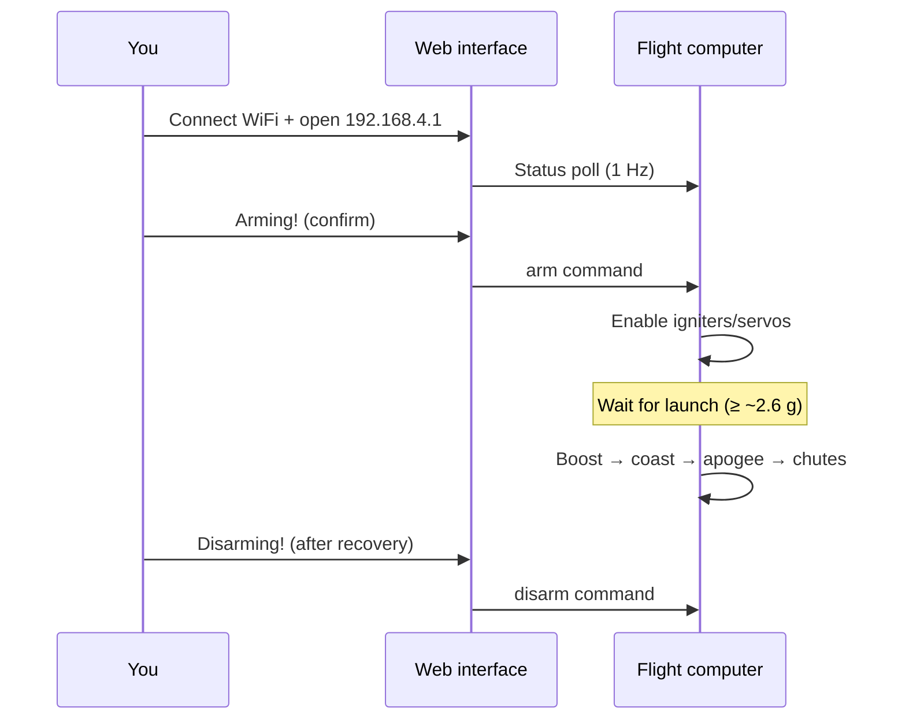
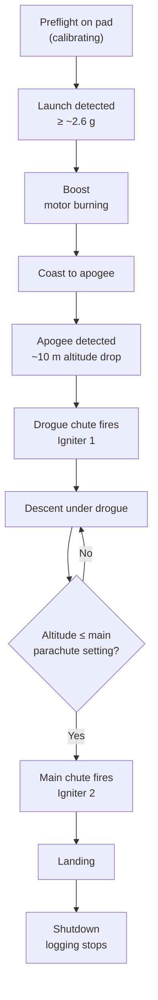

# KPPTR Flight Computer — User Guide

> **Audience:** Rocket operators and team members using the KP-PTR on the pad and in the field.  
> **Hardware details:** [PTR Tracker Hardware](https://github.com/PTR-projects/PTR_tracker_hardware)  
> **Technical internals:** [Developer Guide](DEVELOPER_GUIDE.md)

---

## Table of Contents

1. [What Is KPPTR?](#1-what-is-kpptr)
2. [Safety First](#2-safety-first)
3. [Board Variants](#3-board-variants)
4. [Power-On and Status LEDs](#4-power-on-and-status-leds)
5. [Connecting to the Web Interface](#5-connecting-to-the-web-interface)
6. [Web Interface Overview](#6-web-interface-overview)
7. [Arming and Disarming](#7-arming-and-disarming)
8. [Pre-Flight Checklist](#8-pre-flight-checklist)
9. [What Happens During Flight](#9-what-happens-during-flight)
10. [Mission Settings](#10-mission-settings)
11. [Igniter Testing (IGN Tab)](#11-igniter-testing-ign-tab)
12. [Flight Log Download (Storage Tab)](#12-flight-log-download-storage-tab)
13. [Live Telemetry Tab](#13-live-telemetry-tab)
14. [LoRa Radio Telemetry](#14-lora-radio-telemetry)
15. [Buzzer Signals](#15-buzzer-signals)
16. [Troubleshooting](#16-troubleshooting)

---

## 1. What Is KPPTR?

KPPTR (KP-PTR) is a flight computer for amateur rockets and high-altitude projects. On board it:

- Measures acceleration, altitude, orientation, and GPS position
- Detects flight phases (launch, coast, apogee, descent, landing)
- Fires pyrotechnic igniters for drogue chute, main chute, and optional second-stage motor
- Records high-rate flight data to internal flash memory
- Broadcasts telemetry over **LoRa** (mega boards) and serves a **WiFi web page** for setup and monitoring

You interact with the computer mainly through **WiFi** on the pad. Once armed, it runs autonomously — no laptop required during flight.

---

## 2. Safety First

**Pyrotechnics and high voltage are dangerous. Always follow local laws and your team's written procedures.**

| Rule | Why |
|------|-----|
| Treat every igniter as **live** when the system is **armed** | Arming enables real flight outputs |
| Stay clear of the rocket when **armed** | Launch detection can occur at any time after arming |
| Use the **IGN tab** only on the pad, with propellant **removed** or interlocks in place | Test fires are real electrical igniter pulses |
| Verify **continuity** (green) before arming | Confirms igniter circuit is connected |
| **Disarm** before approaching the rocket after a scrub | Disarm disables flight progression and effectors |
| Do not rely on WiFi during flight | WiFi range is limited; LoRa/logging are the primary recovery aids |

The web interface asks for confirmation before arm, disarm, igniter unlock, and log deletion — read the prompts carefully.

---

## 3. Board Variants

| Model | WiFi network name | Igniters | LoRa radio | Notes |
|-------|-------------------|----------|------------|-------|
| **PTR Mega** (v0.1 / v1.0) | `PTR-mega` | 4 | Yes (433 MHz) | Full-featured tracker |
| **PTR Mini** (ARecorder v3) | `PTR-mini` | 3 | No | Smaller board, no LoRa pins |

Default WiFi password (factory): **`MeteorPTR`** — change it in **Settings** before field use.

---

## 4. Power-On and Status LEDs

After power-on the computer needs a few seconds to start (there is an intentional boot delay for serial debugging). Watch the **status LEDs** on the board:

### Mega v1 — addressable LED strip (8 LEDs)

| LED role | Colour pattern | Meaning |
|----------|----------------|---------|
| **STAT** (system health) | Green blink | All subsystems OK — ready to arm |
| | Orange blink | Still initializing (some components not ready) |
| | Red blink (slow) | Fault — check web **Status** tab |
| **ARM** (arming) | Orange blink | Disarmed — safe on pad |
| | Green blink | **Armed** — flight logic active |
| | Red blink | Arming error |
| **IGN 1–4** | Green / orange / red | Igniter continuity (updates ~every 4 s) |

### Mega v0 / Mini

Fewer or different LED layouts — use the **web Status tab** as the primary indicator if on-board LEDs differ on your revision.



---

## 5. Connecting to the Web Interface

1. Power the flight computer with a suitable battery (typically **≥ 3.7 V**; low battery shows **LOW!** on the web page).
2. On your phone or laptop, open WiFi settings and connect to:
   - **`PTR-mega`** or **`PTR-mini`**
   - Password: **`MeteorPTR`** (unless you changed it)
3. Open a browser and go to: **`http://192.168.4.1/`**
4. The **Status** tab refreshes automatically every second.

**Tips**

- Swipe left/right on mobile to switch tabs.
- Stay within a few metres of the rocket for a stable WiFi link.
- If the page does not load, confirm you are connected to the PTR WiFi network (not home/mobile data).

---

## 6. Web Interface Overview

Five tabs along the top:

| Tab | Purpose |
|-----|---------|
| **Status** | Summary: system health, GPS, battery, tilt, arming; **Arm / Disarm** buttons |
| **Storage** | Download or delete the flight log file |
| **IGN** | Igniter continuity status and ground testing (with unlock) |
| **Settings** | Mission parameters, auto-arm, WiFi password, LoRa options |
| **Live** | Detailed live sensor values (1 Hz refresh while tab is open) |

### Status tab fields

| Field | What it tells you |
|-------|-------------------|
| **System status** | Overall health: OK / WARNING / FAIL |
| **GPS status** | No Fix (red) or Fix OK (green) |
| **GPS satellites** | Number of satellites used |
| **Rocket tilt** | Angle from vertical [degrees] |
| **Battery voltage** | Pack voltage; **LOW!** if below ~3 V |
| **Arming status** | Disarmed! / ARMED! / ERROR |

Component statuses (Analog, LoRa, ADCS, Storage, etc.) appear on the **Live** tab and reflect individual subsystem checkout.

---

## 7. Arming and Disarming

### Disarmed (default after boot)

- Flight phase stays in **startup / calibration**
- Igniters and servos are **electrically blocked** by software
- Safe to work on the rocket (still treat pyrotechnics with care)

### Armed

- Flight computer **detects launch** and progresses through flight phases automatically
- Igniters and servos are **enabled** — pyrotechnic outputs can fire in flight
- Gyro and barometer reference finish calibrating, then the unit waits for **launch**

### How to arm

**Manual:** Status tab → **Arming!** → confirm the dialog.

**Automatic:** If **Autoarming** is enabled in Settings, the computer arms itself after all systems report OK and the configured delay elapses (see [Mission Settings](#10-mission-settings)).

### How to disarm

Status tab → **Disarming!** → confirm.

Disarm works after auto-arm as well. Use this after a scrub or when approaching the rocket.



---

## 8. Pre-Flight Checklist

Use this before every launch:

- [ ] Battery charged (**> 3.7 V** on Status tab)
- [ ] **System status** = OK (green)
- [ ] GPS fix acquired (recommended for recovery mapping)
- [ ] All required igniters show **Connected** (IGN tab)
- [ ] Mission **Settings** reviewed and **Save changes** pressed
- [ ] Drogue and main charges installed; **stage-2** wiring correct if used
- [ ] Team cleared from pad
- [ ] **Arm** only when ready to launch (or enable auto-arm with appropriate delay)
- [ ] WiFi link verified; optional LoRa ground station listening

**After arming:** the computer detects launch when acceleration exceeds roughly **2.6 g** for a short period. It will **not** enter boost until then — remaining in preflight on the pad is normal.

---

## 9. What Happens During Flight

You do not need to press anything during flight. Typical **single-stage** sequence:



### Default igniter assignment (Mega, standard config)

| Igniter # | Default role |
|-----------|--------------|
| **1** | Drogue (apogee deployment) |
| **2** | Main parachute (at configured altitude) |
| **3** | Second-stage motor (multi-stage rockets only) |
| **4** | Not used in default firmware mapping |

### Two-stage rockets

If a second stage is configured:

1. After first motor burnout, a **staging delay** timer runs (Settings → **Staging delay**).
2. Stage-2 igniter fires automatically.
3. Second burn is detected by acceleration; coast and recovery proceed as above.

### Flight state numbers (Live tab)

The **flight_state** value in telemetry is a numeric code:

| Value | Phase |
|-------|-------|
| 0 | Startup / calibration |
| 1 | Preflight (armed, on pad) |
| 2 | Boost |
| 3–5 | Second-stage sequence |
| 6 | Free flight (coast) |
| 7 | Freefall (apogee — drogue command) |
| 8–11 | Under parachutes / recovery |
| 12 | Landing |
| 13+ | Shutdown / error states |

### Data logging

High-rate data is written to flash **only between boost and shutdown**. Download the log after the flight from the **Storage** tab.

---

## 10. Mission Settings

Open **Settings** → adjust values → **Save changes**.

Settings are stored in non-volatile memory and survive reboot.

### Settings reference

| Setting | Default | What it does |
|---------|---------|--------------|
| **Launchpad height [m]** | 2 m (2000 mm stored) | Launch site elevation reference — **saved; not yet used by flight logic** |
| **Main parachute altitude [m]** | 200 | **Main chute fires** when barometric altitude falls to this value during drogue descent |
| **Drouge parachute altitude [m]** | 0 / −1 in UI | **Saved; not yet used** — drogue currently fires at **apogee**, not at this altitude |
| **Staging delay [s]** | 0 | Delay after first burnout before **stage-2 igniter** fires (multi-stage) |
| **Staging max tilt [deg]** | 0 | **Saved; not yet used** by flight logic |
| **Autoarming** | Enable | Automatically arm after checkout + delay |
| **Auto arming time [s]** | 60 (UI) | Countdown before auto-arm. Firmware accepts **30–300 s**; values outside that range fall back to **30 s** |
| **WiFi password** | `MeteorPTR` | Access-point password (8–12 characters in UI) |
| **LoRa mode** | — | Network / exclusive routing (mega boards only) |
| **LoRa frequency [MHz]** | 433.125 | Must match your ground station |
| **LoRa encryption key** | 0 | Must match ground station if encryption is used |

> **Note:** Some fields appear in Settings for future features. Today, the flight computer actively uses **main parachute altitude** and **staging delay**. Drogue deployment is automatic at apogee.

After changing WiFi password or LoRa frequency, reconnect to the network or restart as prompted.

---

## 11. Igniter Testing (IGN Tab)

Use this **on the ground only**, with safe test igniters or approved test setup.

### Continuity indicators

| Display | Meaning |
|---------|---------|
| **Connected** (green) | Igniter circuit detected |
| **Missing!** (red) | Open circuit — check wiring and match |
| **BAT missing!** (orange) | Cannot measure — battery too low for continuity test |

### Test fire procedure

Each igniter is **locked by default** (FIRE button disabled):

1. Tap **UNLOCK** → confirm → button changes to **SECURE**, label shows **Unlocked!** (red).
2. Tap **FIRE!** — sends a **100 ms** electrical pulse, then turns off automatically.
3. Tap **SECURE** (same button) to lock again.

**Important**

- Test firing requires the web command key (built into firmware; not shown in UI).
- You cannot fire an igniter that is already ON.
- Flight igniter outputs are only enabled when the system is **armed**; ground test uses a separate web command path.
- **PTR Mini** has **3 igniters** — ignore Igniter 4 on that hardware.

---

## 12. Flight Log Download (Storage Tab)

| Button | Action |
|--------|--------|
| **Download log** | Raw binary file `meas.bin` — full flash log |
| **Download CSV** | Browser converts log to spreadsheet-friendly **meas.csv** |
| **Remove log** | Deletes log from memory (requires confirmation) |

### CSV download

- Runs entirely in your browser — no extra software needed.
- May take a while for long flights; button shows **Converting...** while working.
- Columns include time, IMU, GPS, altitude, flight state, igniter states, battery, and servos.

### When to download

After every flight you want to analyse. The log is **not** sent over WiFi during flight; you must download on the pad or in the workshop while powered and connected.

---

## 13. Live Telemetry Tab

Shows detailed values updated at **1 Hz** while the tab is open:

- IMU acceleration and gyro
- Magnetometer
- Barometric pressure and temperature
- GPS position and fix
- AHRS altitude, ascent rate, quaternions
- Per-component driver status

Use **Status** for a quick go/no-go; use **Live** for detailed pad diagnostics.

---

## 14. LoRa Radio Telemetry

**PTR Mega boards only** (not Mini).

| Phase | Transmit rate |
|-------|---------------|
| On pad / after landing | ~1 packet per second |
| In flight | ~2 packets per second |

Configure **frequency** and **encryption key** in Settings to match your ground receiver. Packet format uses type `0xAA` (legacy full) with IMU, altitude, velocity, GPS, and flight state — coordinate with your ground-station software version.

WiFi and LoRa operate independently; you can log and transmit simultaneously.

---

## 15. Buzzer Signals

The on-board buzzer gives audible cues:

| Event | Sound |
|-------|-------|
| System **armed** | Five short beeps |
| **Flight phase change** | Two short beeps |
| **Apogee / freefall** detected | Five very short beeps |
| **Drogue deployment** | One long beep (~4 s) |

---

## 16. Troubleshooting

| Problem | What to try |
|---------|-------------|
| Cannot connect to WiFi | Verify SSID (`PTR-mega` / `PTR-mini`); check password; power-cycle |
| Web page stuck on `????` | Wait for boot (~5 s); move closer; refresh browser |
| **System status** FAIL | Open **Live** tab — identify which driver is FAIL; check wiring/power |
| **Arming status** stays Disarmed | Wait for all components OK (green STAT); checkout must pass first |
| Auto-arm never happens | Enable auto-arm in Settings; set delay ≥ 30 s; all systems must be OK |
| Armed but never launches | Normal on pad until **≥ ~2.6 g** — check motor/launch rail |
| **LOW!** battery | Replace or recharge before arming |
| GPS **No Fix** | Move outdoors; wait; check antenna connection |
| Igniter **Missing!** | Reseat igniter plug; check continuity with ohm meter |
| FIRE button greyed out | Unlock igniter first (IGN tab) |
| Empty / missing log | Logging only runs during flight (boost → shutdown); repeat flight or check Storage status |
| CSV download fails | Try **Download log** raw file; check browser console; ensure log exists |
| LoRa no data on ground | Mega board only; verify frequency/key; check LoRa driver status on Live tab |

For build, flash, and developer-level diagnostics, see [Developer Guide](DEVELOPER_GUIDE.md) and [INDEX.md](../INDEX.md).

---

## Quick Reference Card

```
WiFi:     PTR-mega / PTR-mini
Password: MeteorPTR (change in Settings)
Web:      http://192.168.4.1/

Pad flow:  Power → WiFi → Status OK → Settings → IGN check → Arm → Launch

Igniters:  1 = Drogue (apogee)   2 = Main (altitude)   3 = Stage-2

Disarm:    Always disarm before approaching rocket after scrub
```

---

*Document version: 2026-08-31 · Firmware: main @ 27304e2*
